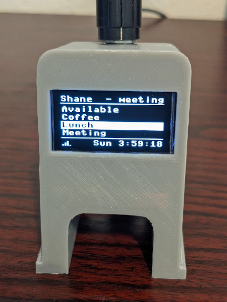
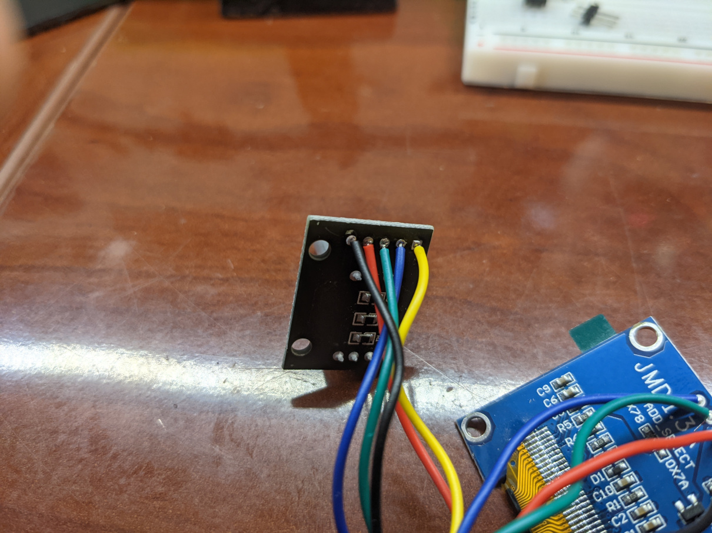

# ESP8266 Slack Status Updater
Based on [Slack Status Updater With ESP8266](https://www.instructables.com/Slack-Status-Updater-With-ESP8266/) by Becky Stern



# Required Hardware 
- Wemos D1 Mini [Amzon](https://www.amazon.com/gp/product/B081PX9YFV/)
- 128x64 pixel SH1106 oled display [Amazon](https://www.amazon.com/gp/product/B08V97FYD2/)
- Rotary encoder with push button [Amazon](https://www.amazon.com/gp/product/B07T3672VK/ref=ppx_yo_dt_b_search_asin_image?ie=UTF8&psc=1)
    - If you can find a rotary encoder without the header pins, it will be easier to build.
- 5-pin header wire [Amazon](https://www.amazon.com/gp/product/B0789F2Y1T/ref=ppx_yo_dt_b_asin_title_o09_s00?ie=UTF8&psc=1)
    - I used these 8-pin and cut off 3 pins.
- 3D Printed Housing [ThingiVerse](https://www.thingiverse.com/thing:4879479)
- 2x M2x6mm HexHead screws

# Features
- 100% OpenSource MIT License.
- Set your current status.
- Set an Expiring (in x minutes) status.
- Polls curent status every 60 seconds.
- Configure your own status and icons.
- Room for up to 15 unique status.
- ScreenSaver triggers after 60 minutes of no input.  Simply turn the rotary dial to wake back up.
- Web Based Configuration.

# Obtain a unique to you Slack-Token
In order for the status to be correctly sent to your account, you must first obtain a unique `Slack-Token`.

Original Insructions are here https://github.com/witnessmenow/arduino-slack-api#getting-auth-token-this-may-change

Ask your Slack Admin for help getting a slack token.
If your org already has a custom app created for this device, you might need to only add it to your slack account.

# Initial Setup
1. Plug in USB Power.  A fresh unconfigured device will automatically start up in **Access Point** mode.
    * You can force it to start in AP config mode by holding down the rotary dial while plugging into USB  power.
2. Connect your phones (or laptops) wifi to the **EasySlackStatus** Access Point.
3. The default WiFi password is ```12345678```
4. Once connected, open a browser to any URL. It will be auto redirected to the web-config.  The default IP is `192.168.4.1`
    * `Thing Name` = Just the simple name of this device. No need to change.
    * `AP Password` = Serves 2 purposes.  It becomes the new WiFi password when connecting to this device.  This also becomes the Admin password to this config page.  You MUST set this value to something.
    * `WiFi SSID` = The WiFi SSID/Name of your home wifi to connect to.
    * `WiFi Password` = Your home wifi password.
    * `Slack Token` = Your personal slack-access token (see below). Must be rebooted after setting this.
    * `TZ` = The Timezone you are in.  Curently only support for short list of TZ. To add more, just update the list of TZs in the code and submit a PR.  A reboot will be necessary for this to take affect.
    * `Status 1-15` = The list of default status selections.  You can modify these later on using your computer after connecting to your local WiFi.  See below for more info.
5. Disconnect from the devices WiFi, it should trigger the device to try and connect to your WiFi.
6. If it all worked, it should present the list of status to choose from.


# Send a permanent status
1. Rotate the dial until the status you want is hilighted.
2. Single Press the dial.
    * The top right corner should show a `sending...`
    * Followed by chaning to the status you sent, as well as your name showing in the top left.
    * ERROR simply means.. well. .something went wrong.  Try again.


# Send an Expring status
1. Rotate the dial until the desired status is hilighted.
2. Double-Press (quickly) the rotary dial to enter `Expire In` selection screen.
3. Rotate the dial to set the minutes to expire.  The default minutes is pulled from the `Default Expire In Minutes` field on the webconfig.
4. Press the rotary dial once to send the status.

# View WiFi Info
1. Long Press the rotary dial to switch back-and-forth between the main status selection screen, and the WiFi Info Screen.

# Configure your Status List 
1. Long Press the rotary dial to view the connected IP address.
2. Open your laptop webbrowser to the URL shown (eg. http://10.0.1.4/)
3. Set any of the 1-15 different status sections to what ever you want.
    * `Status` - Simply the text name of your status.  Max 10 chars.
    * `Icon` - MUST be wrapped in ':' .  eg.. `:coffee:`  NOT `coffee`. A list of emoji icons can be found at https://www.webfx.com/tools/emoji-cheat-sheet/
    * `Default Expire in Minutes` - The value that is pre-populdated when you double-press the rotary to send an expiry status. 0-999 are valid values.


# FAQ
* *What is the default admin password?*
    * 12345678

* *How do I force into Config Mode?*
    * Unplug the power
    * hold down the rotary dial
    * plug in the power
    * wait for splash screen to change to the AP config screen

* *How do I find the current IP address and WiFi settings?*
    * Long Press the rotary dial.
    * Should show the current WiFi status, ip, config URL and Time.
 
* I forgot my AP Admin Password
    * Boot into a forced Config Mode. The default AP password `12345678` will be used.

* How can I view the serial output of the Arduino?
    * Simply connect the USB to your laptop, and open a serial terminal with a baud rate of `115200`.

# Build from Sources
1. install PlatformIO Core CLI toolset 
    * https://platformio.org/install/cli
    * Easiest is just one of the following:
        * `pip install -U platformio`
        * `homebrew install platformio`
2. Clone this repo
3. Init Submodules
    * `git submodule update --init --recursive`
    * This will pull down the current branches in both `lib/IotWebconf` and `lib/arduino-slack-api` submodules.
4. Update Submodules as needed with
    * `git submodule update --recursive --remote`
5. `pio lib update`  (optional, but ensures the recent libs are fetched now)
6. `pio run --target clean`
7. `pio run`
7. `pio run --target upload` 

## Alter Boot-Splash
1. Start with the above build from sources.
2. The boot image is hard-coded in the `Adafruit_I2C_SH1106.cpp` file.
3. `static uint8_t buffer[BUFFER_SIZE]` contains the image.
4. Obtain an image exactly 128x64 px in size.
5. Use an online image converter like (https://javl.github.io/image2cpp/) to create a new default buffer array.

## Wipe D1 Minit Flash Completely to start totally fresh
`pio run --target erase`

# Flash new Firmware
1. Download latest `firmware/vX.Y.Z.bin` file from here.
2. Open web browser to config page.
3. Scroll to bottom to find `Firmware Update` link.
4. Verify firmare version `before` and `after` update.
5. Upload new firmware.  Takes about 30 seconds.  Device should reboot automatically. There is currently no filesystem update needed.

# Build your own

## Wemos D1
Solder a pair of 5-pin headers to the Wemos D1. Orient the pins so they point up on the same side as the main ESP8266 module. For clearance inside the 3D printed case, remove the plastic header supports. 

Solder between Pins `3.3v-D5` and `G-D1`.


The colors below indicate the wire color used on the 5 pin header wires.

### 5-pin
* Wemos-GND -> OLED & Rotary GND **Black**
* Wemos-D4 -> Not Used
* Wemos-D3 -> Not Used
* Wemos-D2 -> OLED-SDA **Blue**
* Wemos-D1 -> OLED-SCL **Green**
### 5-pin
* Wemos-3.3v -> OLED & Rotary VCC **Red**
* Wemos-D8 -> Not Used
* Wemos-D7 -> Roatry-CLK **Yellow**
* Wemos-D6 -> Rotary-DT **Blue**
* Wemos-D5 -> Rotary-SW **Green**

## 5-pin Connectors


* White,Brown & Gray discarded if using 8pin connectors.
* Red wire from 1 connector, added to other connector for 2 red wire outputs.
* Black wire removed from 1st connector, used to add 2nd parallel ground wire to other connector.
* Black pin moved from p2 to p1. Extra black wire added in parallel.


## Rotary Encoder


## OLED


## Connected


## Installed
A small dab of HotGlue on each of the 4 posts holds the OLED in place.


# License
[MIT license](license.txt)
 
